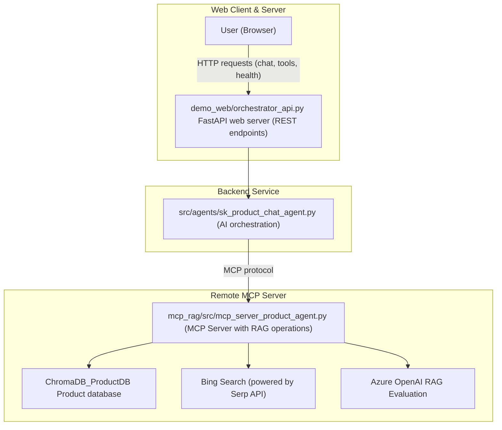

# Agentic AI in Python - A Code Walkthrough

Curious how to bring agentic AI to life using Python? Want to see how Semantic Kernel can orchestrate real-world AI behavior?

In this hands-on walkthrough, we’ll walk through the code necessary to build a Python-based product Q&A chatbot that goes beyond basic RAG implementations. You’ll see how to give your AI agent the ability to:

- Pull product data from a vector store
- Enhance RAG answers with live web search
- Evaluate hallucination risk
- Respond with a trust score for transparency

We’ll explore how Semantic Kernel enables agentic behavior; and, along the way, you’ll learn how to ground responses in multiple data sources and implement an evaluation loop to keep your AI honest.

If you're a developer looking to move from experimentation to real-world AI applications, this walkthrough will give you the tools, patterns, and confidence to build smarter, more reliable agents in Python.

# **🚨 Important:** 
This is a newly created demo repository, created in-part through the power of vibe coding. Refactoring is needed prior to any implementation.

## Key Technologies

- **[Microsoft Semantic Kernel](https://learn.microsoft.com/en-us/semantic-kernel/overview/)**: AI orchestration framework for building intelligent agents
- **[Model Context Protocol (MCP)](https://modelcontextprotocol.io/docs/getting-started/intro)**: Standardized protocol for connecting AI systems to tools
- **[ChromaDB](https://docs.trychroma.com/docs/overview/introduction)**: Open-source vector database
- **[SerpAPI](https://serpapi.com/)**: Search API for performing Bing Web searches
- **[FastAPI](https://fastapi.tiangolo.com/)**: Modern web framework for building APIs
- **[Poetry](https://python-poetry.org/)**: Python dependency management

## Flow and Architecture

### Request Flow



### Architecture - Agentic Application (`.`)

```
📁 demo_web/                         🌐 Frontend Web Interface
├── orchestrator_api.py                 - FastAPI web server (REST endpoints)
└── static/orchestrator.html            - HTML/CSS/JavaScript frontend

📁 notebooks/                        📓 Notebooks
├── demo_sk_product_agent.ipynb         - Demo notebook for the product agent

📁 src/                              🧠 Backend AI Orchestration Logic
├── agents/sk_product_chat_agent.py     - Main AI agent using Semantic Kernel
├── client/                             - MCP client integration layer
│   ├── plugins/                        - Framework-specific integrations
│   └── core/                           - Protocol-agnostic MCP functionality
└── utils/                              - Configuration and utilities
```

### Architecture - MCP Server (`mcp_rag/`)

```
📁 data/chroma_db                    📚 Chroma product database files
📁 src/                              🧠 MCP Server source files
├── models/                             - Structured python data models
├── tools/                              - MCP tool modules
├── utils/                              - Configuration and utilities
├── mcp_server_fundamentals.py          - Bare bones sample MCP server
└── mcp_server_product_agent.py         - Product agent associated MCP server with RAG tools and evaluation logic
```

## Getting Started

### 1. Install Dependencies
```bash
poetry install
```

## 2. Config

Configuration is managed through environment variables and `.env` files. See the [.env.example](.env.example) file for an example.


### 3. Start the MCP Server

Run the below. Consider renaming the terminal to "mcp_server".

```bash
# In terminal 1
.\start_mcp_rag_server.bat
```

### 4. (Optional) Start the Web Interface
```bash
# In terminal 2
.\start_orchestrator_web.bat

# Open browser to: http://localhost:8001
```

### 5. Run the demo

Run [notebooks/demo_sk_product_agent.ipynb](notebooks/demo_sk_product_agent.ipynb) to see the agent in action.

Run [mcp_rag/notebooks/demo_rag.ipynb](mcp_rag/notebooks/demo_rag.ipynb) to see the MCP server in action.


